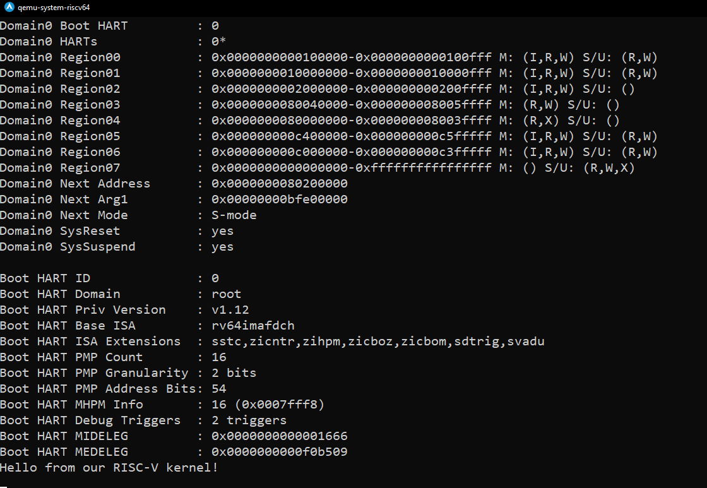
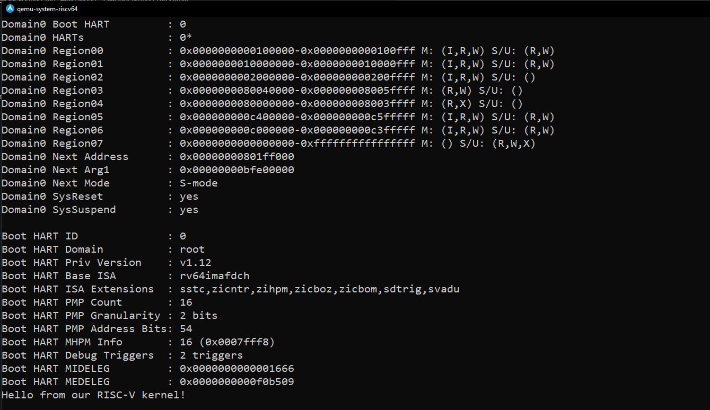

# Writing a kernel for RISC=V 
## Booting and "Hello World"

### Introduction 
RISC-V is an open source ISA (Instruction Set Algorithm) developing by Berkeley for reducing license prices for all. So today we're going to dive in to RISC-V boot process and writing our first kernel by sending "Hello World" to our console.

### RISC-V Boot Process

[PDF Link]([]https://riscv.org/wp-content/uploads/2024/12/13.30-RISCV_OpenSBI_Deep_Dive_v5.pdf)
As we use x86 on usual, when the computer first boots-up, it loads BIOS from hard-coded memory (ROM). It's practically the same in RISC-V. The CPU jumps to ROM and firmware for initializing core hardware parts, but after that instead of BIOS or UEFI, it uses a special SBI (Software Binary Interface) called "OpenSBI".

### What is OpenSBI

OpenSBI is a runtime firmware responsible for

- System initalization (UART, PLIC, Timers, etc...)
- Configures previliges
- Handling Mode switches
- Booting to bootloader, or directly to kernel.

So it's basically a more fundemental bootloader. It initialalizes core hardware, switches machine mode to supervisor mode (This is where kernel works).

It provides some kind of functions just like BIOS such as: 

= sbi_console_putchar() Puts a char to UART
- sbi_set_timer()	      Sets a timer interrupt
- sbi_shutdown()        Powers off the machine

Also when the kernel needs to communicate with hardware it sends an SBI call to OpenSBI. It's just like the system calls but for kernel to a lower lever "kernel". But OpenSBI can't do much as BIOS such as reading from disk, or detect OSes.


[ Boot ROM ]
   ↓
[ FSBL or U-Boot ]
   ↓
[ OpenSBI (M-mode) ]
   ↓
[ Linux / Your kernel (S-mode) ]


This is the diagram long story short.

Now let's work on our kernel.

### Downloading and compiling openSBI

Note: Standart Qemu has opensbi itself, it may outdated but this step is not really neceserry.

Make sure you installed [GNU Toolchain For RISC-V](https://github.com/riscv-collab/riscv-gnu-toolchain)
for Arch Linux: 
sudo pacman -S riscv64-linux-gnu-gcc

Also the qemu-full package

[you can check the full manual](https://doc-en.rvspace.org/VisionFive/Software_Technical_Reference_Manual/VisionFive_SWTRM/compiling_opensbi.html)
1 Clone the repo
`git clone https://github.com/riscv/opensbi.git
`
2 Change directly
cd opensbi

3 Compile it

There's 3 opensbi modes 
fw_payload:
The FW_PAYLOAD firmware directly includes the binary code for the booting stage to follow OpenSBI firmware execution. Typically, this payload will be a bootloader or an OS kernel.

fw_jump:
The FW_JUMP firmware assumes a fixed address of the next booting stage entry, e.g. a bootloader or an OS kernel, without directly including the binary code for this next stage.

fw_dynamic: 
The FW_DYNAMIC firmware gets information about the next booting stage entry, e.g. a bootloader or an OS kernel, from previous booting stage at runtime.

[You can check more information in here](https://github.com/riscv-software-src/opensbi/blob/master/docs/firmware/fw.md)

in our example we will use fw_dynamic for our own sanity


To start qemu with our OpenSBI

```bash
qemu-system-riscv64 \
-machine virt \
-nographic \ 
-bios fw_dynamic.elf
```


OpenSBI v1.5.1
   ____                    _____ ____ _____
  / __ \                  / ____|  _ \_   _|
 | |  | |_ __   ___ _ __ | (___ | |_) || |
 | |  | | '_ \ / _ \ '_ \ \___ \|  _ < | |
 | |__| | |_) |  __/ | | |____) | |_) || |_
  \____/| .__/ \___|_| |_|_____/|____/_____|
        | |
        |_|

Platform Name             : riscv-virtio,qemu
Platform Features         : medeleg
Platform HART Count       : 1
Platform IPI Device       : aclint-mswi
Platform Timer Device     : aclint-mtimer @ 10000000Hz
Platform Console Device   : uart8250
Platform HSM Device       : ---
Platform PMU Device       : ---
Platform Reboot Device    : syscon-reboot
Platform Shutdown Device  : syscon-poweroff
Platform Suspend Device   : ---
Platform CPPC Device      : ---
Firmware Base             : 0x80000000
Firmware Size             : 327 KB
Firmware RW Offset        : 0x40000
Firmware RW Size          : 71 KB
Firmware Heap Offset      : 0x49000
Firmware Heap Size        : 35 KB (total), 2 KB (reserved), 11 KB (used), 21 KB (free)
Firmware Scratch Size     : 4096 B (total), 416 B (used), 3680 B (free)
Runtime SBI Version       : 2.0

Domain0 Name              : root
Domain0 Boot HART         : 0
Domain0 HARTs             : 0*
Domain0 Region00          : 0x0000000000100000-0x0000000000100fff M: (I,R,W) S/U: (R,W)
Domain0 Region01          : 0x0000000010000000-0x0000000010000fff M: (I,R,W) S/U: (R,W)
Domain0 Region02          : 0x0000000002000000-0x000000000200ffff M: (I,R,W) S/U: ()
Domain0 Region03          : 0x0000000080040000-0x000000008005ffff M: (R,W) S/U: ()
Domain0 Region04          : 0x0000000080000000-0x000000008003ffff M: (R,X) S/U: ()
Domain0 Region05          : 0x000000000c400000-0x000000000c5fffff M: (I,R,W) S/U: (R,W)
Domain0 Region06          : 0x000000000c000000-0x000000000c3fffff M: (I,R,W) S/U: (R,W)
Domain0 Region07          : 0x0000000000000000-0xffffffffffffffff M: () S/U: (R,W,X)
Domain0 Next Address      : 0x0000000000000000
Domain0 Next Arg1         : 0x0000000087e00000
Domain0 Next Mode         : S-mode
Domain0 SysReset          : yes
Domain0 SysSuspend        : yes

Boot HART ID              : 0
Boot HART Domain          : root
Boot HART Priv Version    : v1.12
Boot HART Base ISA        : rv64imafdch
Boot HART ISA Extensions  : sstc,zicntr,zihpm,zicboz,zicbom,sdtrig,svadu
Boot HART PMP Count       : 16
Boot HART PMP Granularity : 2 bits
Boot HART PMP Address Bits: 54
Boot HART MHPM Info       : 16 (0x0007fff8)
Boot HART Debug Triggers  : 2 triggers
Boot HART MIDELEG         : 0x0000000000001666
Boot HART MEDELEG         : 0x0000000000f0b509

```
```
we get these informations in our screen. 
As you might see the address is 0x80000000 for OpenSBI.
As usual it starts to jump address 0x80200000 for kernel.
Since we didn't load any kernel. The Next load address is currently null.
Domain0 Next Address      : 0x0000000000000000


### Writing The Kernel

initializing stack and jumping to kernel in assembly

```asm
    .section .text
    .globl _start
    .globl kmain
_start:
    # Set up stack pointer (adjust as you want)
    la sp, stack_top

    # Call kmain (extern function)
    call kmain

    # Infinite loop after kmain returns
1:  j 1b

    .section .bss
    .align 12          # 2^12 = 4096 bytes stack alignment
    .space 0x4000      # 16KB stack

stack_top:

```

in this simple assembly code, we're allocating 16kb of stack for our kernel. after that we're just jumping to kmain function (written in kmain.c file)

kmain.c

```c
typedef unsigned char  uint8_t;
typedef unsigned long  uint64_t;

#define UART0_BASE 0x10000000 // Uart pointer
volatile uint8_t* const uart = (uint8_t*) UART0_BASE;

void uart_putc(char c) {
    uart[0] = c;
}

void uart_print(const char* str) {
    while (*str) {
        uart_putc(*str++);
    }
}

void kmain() {
    uart_print("Hello from our RISC-V kernel!\n");

    while (1) { }
}
```

In this code snippet we're pushing characters to 0x10000000 address which is the pointer of UART.

compile kernel.s and kmain.c files with 

```bash
riscv64-linux-gnu-as -o kernel.o kernel.s
riscv64-linux-gnu-gcc -c -nostdlib -nostartfiles -ffreestanding -o kmain.o kmain.c
riscv64-linux-gnu-ld -o kernel.elf kernel.o kmain.o
```


let's load our kernel into qemu again by

```bash
qemu-system-riscv64 \
-machine virt \
-nographic \ 
-kernel kernel.elf
```

Aand, we don't see anything. It's because kernel address is not aligned with OpenSBI jump address.
as you might see Domain0 Next Address      : 0x0000000000010000
Our boot address is now diffrent.

Let's inspect our kernel.elf file 

```bash
riscv64-elf-objdump -f kernel.elf
```
results:

```
kernel.elf:     file format elf64-littleriscv
architecture: riscv:rv64, flags 0x00000112:
EXEC_P, HAS_SYMS, D_PAGED
start address 0x0000000000010120
```

To fix that we could add -Ttext=0x10000 parameter to our linker command

```bash
riscv64-elf-ld -Ttext=0x10000 -o kernel.elf kernel.o kmain.o
```

but then we have to turn it into the raw binary (i don't really know the reason yet.)

riscv64-linux-gnu-objcopy -O binary kernel.elf kernel.bin

```bash
qemu-system-riscv64 \
-machine virt \
-nographic \ 
-kernel kernel.bin
```

And finally we have


Or as the second solution we could write a linker script for easier use.
Note: It might be a diffrent jump address. If you don't see message on the screen you might want to check it first.

```ld
ENTRY(_start)

SECTIONS {
  . = 0x00000000801ff000;
  .text : {
    *(.text*)
  }

  .rodata : {
    *(.rodata*)
  }

  .data : {
    *(.data*)
  }

  .bss : {
    *(.bss*)
    *(COMMON)
  }
}
```

