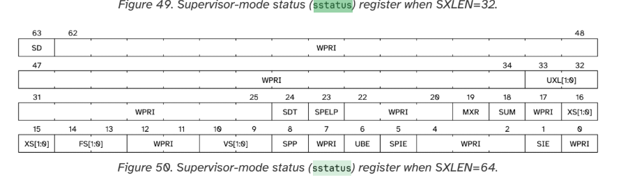
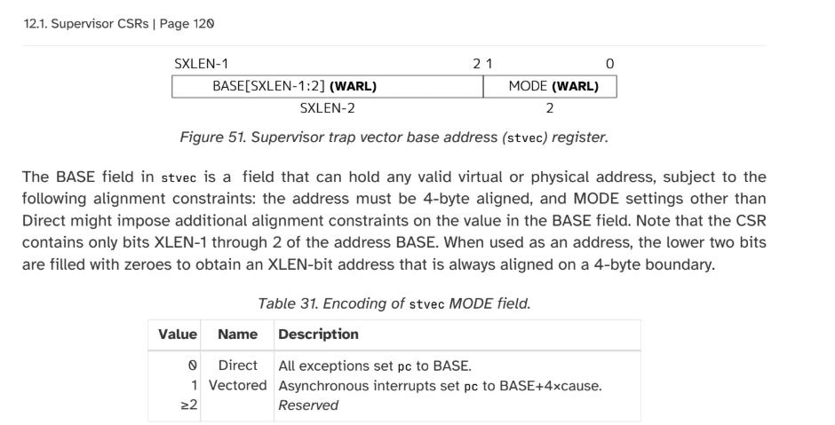
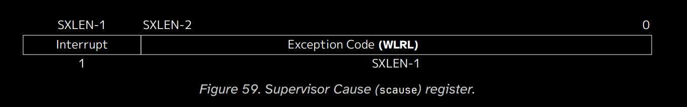
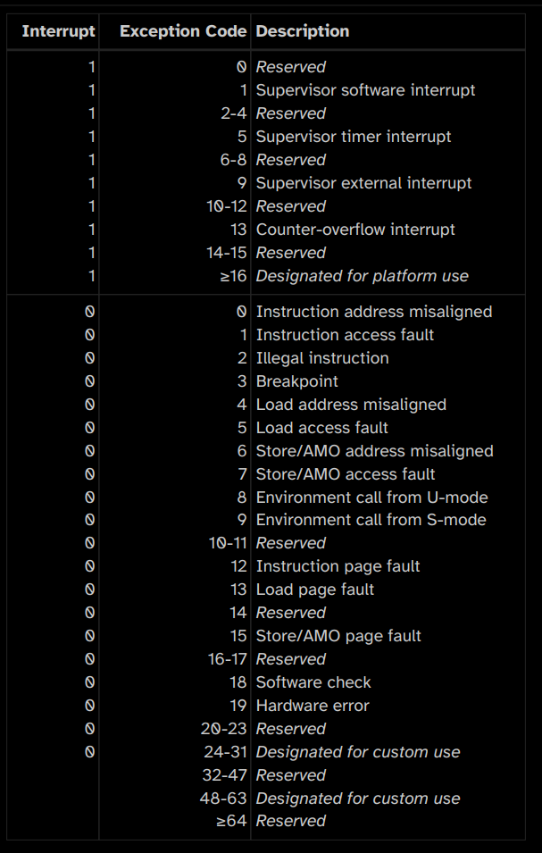

# Writing a kernel for RISC-V 
## Interrupts and Exceptions (Traps)

### Introduction 
In the first episode we ran our qemu virtual machine and printed our first "Hello World" kernel in RISC-V. In this episode, we will be looking at "Traps" and making our very first timer for waiting before printing our hello world message.

### What are Traps in RISC-V? 
When the we interract with computer from outside, it needs to be communicate with the kernel, and the IO devices such as SSD, Memory, or GPU for drawing pixels on monitor. For doing that we're sending a signal called "Interrupts" to CPU. 

Also when somethings went wrong or a program needs to send a signal immediately to kernel. These can be things like division by zero, invalid memory access, or system calls. Exceptions are signals generated by the CPU itself to notify the kernel that something went wrong with the execution of a program.

Together, Interrupts and Exceptions are referred to as Traps in the RISC-V architecture. Traps are essentially a mechanism to allow communication between the kernel and the rest of the system, whether it's from hardware events (interrupts) or software errors (exceptions).

Interrupts are controlled by PLIC(Platform-Level Interrupt Controller)/CLINT(Core-Local Interruptor). In the other hand exceptions are controlled by the CPU itself.

### What is PLIC? 

The PLIC (Platform-Level Interrupt Controller) is an external device for handling external interrupts such as keyboard, mouse, UART signals. The job of PLIC is: 
- Detect interrupt requests from devices
Prioritize them based on programmable priority levels
- Route the highest-priority interrupt to the appropriate CPU core (hart)

### Handling traps

PLIC does not handle interrupts by itself. When an interrupt triggers. Whether to the trap handling mode which there 2 in RISC-V. Direct and Vectored handling.

In vectored handling, according to interrupt type, it automaticly jumps to a vectored table. 

Code	Hex	Mask	Abbr	Description
0	0	000001		
1	1	000002	SSI	Supervisor software interrupt
2	2	000004	VSSI	Virtual supervisor software interrupt
3	3	000008	MSI	Machine software interrupt
4	4	000010		
5	5	000020	STI	Supervisor timer interrupt
6	6	000040	VSTI	Virtual supervisor timer interrupt
7	7	000080	MTI	Machine timer interrupt
8	8	000100		
9	9	000200	SEI	Supervisor external interrupt
10	a	000400	VSEI	Virtual supervisor external interrupt
11	b	000800	MEI	Machine external interrupt
12	c	001000	SGEI	Supervisor guest external interrupt
13	d	002000	LCOFI	Local counter overflow interrupt
14	e	004000		
15	f	008000		

In direct mode, without looking into the type it jumps to same function for handling it.

There's some CSR (Control Status Registers) for handling traps in such: stvec, scause, sepc, sstatus, sie... (There's more than that).


- sepc ← address of instruction that caused the trap.
- scause ← trap cause (interrupt or exception ID).
- stval ← optional info (faulting address).
- sstatus ← status of trap handling.


https://lf-riscv.atlassian.net/wiki/spaces/HOME/pages/16154769/RISC-V+Technical+Specifications

we could enable or disable traps in sstatus register.

After we accessing interrupt, we could PLIC or CLINT for getting the IRQ, check the Devicetree for accessing device, and gather these information. We will be learn more about this in episode 3. In this episode we will be only enable traps, test it and make our first simple timer for testing our trap handler.

### Enabling interrupts in sstatus



This is the bits of sstatus register in 64 bit RISC-V. We could enable interrupts in SIE bit (the first one).

Here's the c code for doing it: 

```c
static inline uint64_t read_sstatus(void) {
    uint64_t value;
    asm volatile ("csrr %0, sstatus" : "=r"(value));
    return value;
}

static inline void write_sstatus(uint64_t value) {
    asm volatile ("csrw sstatus, %0" :: "r"(value));
}

void enable_supervisor_interrupts(void) {
    uint64_t sstatus = read_sstatus();
    sstatus |= (1 << 1);  // Set SIE bit
    write_sstatus(sstatus);
}
```

### Setting function address in stvec



In stvec, we need to specify the address of our handler function. In the next 63 bit we'll address it. We must turn our function address to 32-bit in some cases. (My experiences).

In this tutorial we will be use direct mode, so we don't have to enable first bit.

Here's the c code for doing it: 
```c
void set_trap_handler(void (*handler)(void)) {
    uintptr_t addr = (uintptr_t)handler;
    // Clear the lowest 2 bits to align the address
    addr &= ~0x3ULL; 
    // Set mode bits to 0 for direct mode
    addr |= 0x0;
    asm volatile("csrw stvec, %0" :: "r"(addr));
}

```

We clear the lowest 2 bits of the handler address to ensure it's aligned to 4 bytes. As i writing this tutorial i haven't tried it yet. Probably i'm gonna delete this line as well.


### Writing trap handler function

In our function we will look to scause csr for whether it's an interrupt or exception.




The last bit of sstatus register defines is the trap an interrupt or an exception. So we will be read it to determine. And the rest of it is the exception code.



Here's the all possible codes.

https://dram.page/riscv-trap/

A cheatsheat for more.

```c
// Supervisor Interrupt Codes (scause MSB=1)
typedef enum {
    INTERRUPT_INSTR_ADDR_MISALIGNED = 0, // Not an interrupt, example exception code included by mistake
    INTERRUPT_SSI   = 1,  // Supervisor software interrupt
    INTERRUPT_VSSI  = 2,  // Virtual supervisor software interrupt
    INTERRUPT_MSI   = 3,  // Machine software interrupt
    INTERRUPT_RESERVED_4 = 4,
    INTERRUPT_STI   = 5,  // Supervisor timer interrupt
    INTERRUPT_VSTI  = 6,  // Virtual supervisor timer interrupt
    INTERRUPT_MTI   = 7,  // Machine timer interrupt
    INTERRUPT_RESERVED_8 = 8,
    INTERRUPT_SEI   = 9,  // Supervisor external interrupt
    INTERRUPT_VSEI  = 10, // Virtual supervisor external interrupt
    INTERRUPT_MEI   = 11, // Machine external interrupt
    INTERRUPT_SGEI  = 12, // Supervisor guest external interrupt
    INTERRUPT_LCOFI = 13, // Local counter overflow interrupt
    INTERRUPT_RESERVED_14 = 14,
    INTERRUPT_RESERVED_15 = 15
} SupervisorInterruptCode;

// Supervisor Exception Codes (scause MSB=0)
typedef enum {
    EXCEPTION_INSTR_ADDR_MISALIGNED = 0,
    EXCEPTION_INSTR_ACCESS_FAULT     = 1,
    EXCEPTION_ILLEGAL_INSTRUCTION    = 2,
    EXCEPTION_BREAKPOINT             = 3,
    EXCEPTION_LOAD_ADDR_MISALIGNED   = 4,
    EXCEPTION_LOAD_ACCESS_FAULT      = 5,
    EXCEPTION_STORE_AMO_ADDR_MISALIGNED = 6,
    EXCEPTION_STORE_AMO_ACCESS_FAULT = 7,
    EXCEPTION_ENV_CALL_FROM_U_OR_VU  = 8,
    EXCEPTION_ENV_CALL_FROM_HS_MODE  = 9,
    EXCEPTION_ENV_CALL_FROM_VS_MODE  = 10,
    EXCEPTION_ENV_CALL_FROM_M_MODE   = 11,
    EXCEPTION_INSTR_PAGE_FAULT       = 12,
    EXCEPTION_LOAD_PAGE_FAULT        = 13,
    EXCEPTION_RESERVED_14            = 14,
    EXCEPTION_STORE_AMO_PAGE_FAULT   = 15,
    EXCEPTION_RESERVED_16            = 16,
    EXCEPTION_RESERVED_17            = 17,
    EXCEPTION_SOFTWARE_CHECK         = 18,
    EXCEPTION_HARDWARE_ERROR         = 19,
    EXCEPTION_INSTR_GUEST_PAGE_FAULT = 20,
    EXCEPTION_LOAD_GUEST_PAGE_FAULT  = 21,
    EXCEPTION_VIRTUAL_INSTRUCTION    = 22,
    EXCEPTION_STORE_AMO_GUEST_PAGE_FAULT = 23
} SupervisorExceptionCode;

// Define supervisor CSRs enum for readability
typedef enum {
    CSR_SCAUSE = 0x142,  // Supervisor Cause register
    CSR_STVAL  = 0x143,  // Supervisor Trap Value (faulting addr)
    CSR_SEPC   = 0x141   // Supervisor Exception Program Counter
} Csr;
// Read a CSR given its number
static inline uint64_t csr_read(Csr csr) {
    uint64_t value;
    switch (csr) {
        case CSR_SCAUSE:
            asm volatile("csrr %0, scause" : "=r"(value));
            break;
        case CSR_STVAL:
            asm volatile("csrr %0, stval" : "=r"(value));
            break;
        case CSR_SEPC:
            asm volatile("csrr %0, sepc" : "=r"(value));
            break;
        default:
            value = 0;
            break;
    }
    return value;
}

void trap_handler(){
    uint64_t scause = csr_read(CSR_SCAUSE);

    // The highest (MSB) bit of scause indicates interrupt (1) or exception (0)

    // The lower bits [62:0] hold the interrupt or exception code
    uint64_t code = scause & 0x7FFFFFFFFFFFFFFF;

    if (is_interrupt) {
        switch ((SupervisorInterruptCode)code) {
            case INTERRUPT_STI:
                // Timer interrupt handler
                break;
            case INTERRUPT_SEI:
                // External interrupt handler
                break;
            default:
                // Unknown interrupt
                break;
        }
    } else {
        switch ((SupervisorExceptionCode)code) {
            case EXCEPTION_ILLEGAL_INSTRUCTION:
                // Handle illegal instruction
                break;
            // other exceptions...
            default:
                // Unknown exception
                break;
        }
    }
}
```

### Analyzing sstatus register

For checking the traps are enabled we could print the sstatus register to UART.
Since we don't have the proper formatting support for uart print, we need to define some more functions for UART.

Let's create uart driver first.

we also need util file for general operations 

util.h file 

```c
#include <stdint.h>

void u64_to_binary(uint64_t value, char* buffer);
char digit_to_char(int d);
```

util.c file

```c
#include <stdint.h>

void u64_to_binary(uint64_t value, char *buffer) {
    for (int i = 0; i < 64; i++) {
        buffer[i] = (value & (1ULL << (63 - i))) ? '1' : '0';
    }
    buffer[64] = '\0'; // null-terminate the string
}

char digit_to_char(int d){
    return (d >= 0 && d <= 9) ? ('0' + d) : '?';
}
```

uart.h file 

```c
#include <stdint.h>
void uart_putc(char c);
void uart_print(const char* str);
void print_uxl(int uxl);
void print_bit(const char* label, int bit_val);
```

uart.c file 

```c
#include <stdint.h>

#define UART0_BASE 0x10000000 // Uart pointer
volatile uint8_t* const uart = (uint8_t*) UART0_BASE;


void uart_putc(char c) {
    uart[0] = c;
}

void uart_print(const char* str) {
    while (*str) {
        uart_putc(*str++);
    }
}

// Helper: print a labeled bit value (0 or 1)
void print_bit(const char* label, int bit_val) {
    uart_print(label);
    uart_print(": ");
    char c[2] = {digit_to_char(bit_val), 0};
    uart_print(c);
    uart_print("\n");
}

// Helper: print UXL field explanation
void print_uxl(int uxl) {
    uart_print("UXL (bits 33:32): ");
    char c[2] = {digit_to_char(uxl), 0};
    uart_print(c);
    uart_print("\n");
    uart_print(" 1=32-bit, 2=64-bit, 3=128-bit\n");
}
```

Now we can write our analyze function

add traps.c

```c
void sstatus_analyze() {
    const uint64_t SD_MASK    = 1ULL << 63;
    const uint64_t UXL_MASK   = 3ULL << 32; // bits 33:32
    const uint64_t SPP_MASK   = 1ULL << 8;
    const uint64_t SPIE_MASK  = 1ULL << 5;
    const uint64_t SIE_MASK   = 1ULL << 1;

    uint64_t sstatus = csr_read(CSR_SSTATUS);

    int sd   = (sstatus & SD_MASK) ? 1 : 0;
    int uxl  = (int)((sstatus & UXL_MASK) >> 32);
    int spp  = (sstatus & SPP_MASK) ? 1 : 0;
    int spie = (sstatus & SPIE_MASK) ? 1 : 0;
    int sie  = (sstatus & SIE_MASK) ? 1 : 0;

    char buf[19];

    u64_to_binary(sstatus, buf);

    uart_print("sstatus binary: ");
    uart_print(buf);
    uart_print("\n");

    uart_print("sstatus analysis:\n");
    print_bit("SD (bit 63)          ", sd);
    print_uxl(uxl);
    print_bit("SPP (bit 8)          ", spp);
    uart_print(" 0=User mode, 1=Supervisor mode\n");
    print_bit("SPIE (bit 5)         ", spie);
    uart_print(" Interrupts enabled before trap\n");
    print_bit("SIE (bit 1)          ", sie);
    uart_print(" Current supervisor interrupt enable\n");
}
```

make the changes in kmain

```c
#include "traps.h"
#include "riscv.h"
#include "util.h"
#include <stdint.h>
#include "uart.h"

void kmain() {
    uart_print("Hello from our RISC-V kernel!\n");

    enable_supervisor_interrupts();

    sstatus_analyze();
    while (1) { }
}
```

much pretty right? 

After all changes, we can run make

```bash
make run
```
```
Hello from our RISC-V kernel!
sstatus binary: 1000000000000000000000000000001000000000000000000110000000000010
sstatus analysis:
SD (bit 63)          : ?
UXL (bits 33:32): ?
 1=32-bit, 2=64-bit, 3=128-bit
SPP (bit 8)          : ?
 0=User mode, 1=Supervisor mode
SPIE (bit 5)         : ?
 Interrupts enabled before trap
SIE (bit 1)          : ?
 Current supervisor interrupt enable
```

### Setting trap handler function to stvec register

Since now we have everything for our trap handling,we can set our function to stvec register.

